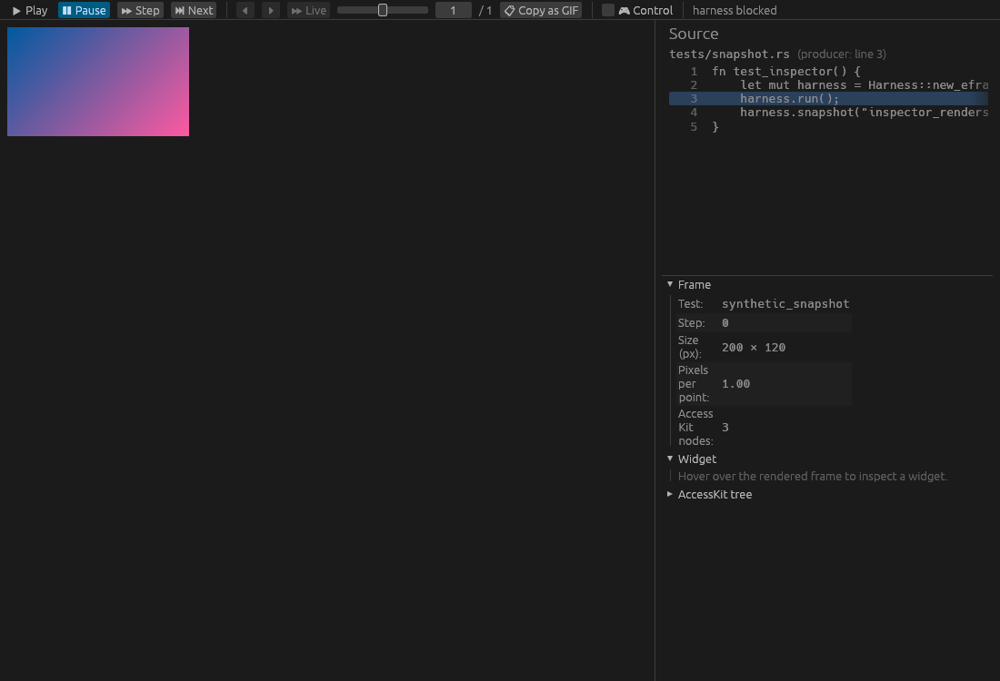

# kittest_inspector

Live inspector app for [`egui_kittest`](https://github.com/emilk/egui/tree/main/crates/egui_kittest) tests.

Allows you to debug your tests by stepping through it frame-by-frame, inspecting node roles and labels
so you can know how to query widgets. You can also take control of the tested app if you need to quickly
debug something. 

See it in action:


https://github.com/user-attachments/assets/0059a58b-e457-4f1b-91f2-7e0c05d409fb


Up-to-date screenshot of the ui:



## Install

```sh
cargo install --git https://github.com/rerun-io/kittest_inspector
```

This puts `kittest_inspector` on your `PATH`. The harness launches it as a child
process and talks to it over stdin/stdout.

## Use

In a test that uses `egui_kittest` with the `inspector` feature (Pending on the [PR](https://github.com/emilk/egui/pull/8119) being merged):

```sh
KITTEST_INSPECTOR=1 cargo test my_test -- --nocapture
```

Or call `.with_inspector()` on your `Harness` to opt in programmatically.

### Env vars

- `KITTEST_INSPECTOR=1` — auto-launch an inspector for every harness in this process.
- `KITTEST_INSPECTOR_PATH=/path/to/kittest_inspector` — override the binary lookup
  (by default the harness looks for `kittest_inspector` on `PATH`).

## Development

To build & run the example from this repo with an example test, you can use the following snippet:
```bash
cargo build && KITTEST_INSPECTOR=1 KITTEST_INSPECTOR_PATH=target/debug/kittest_inspector cargo test --test example_app
```
